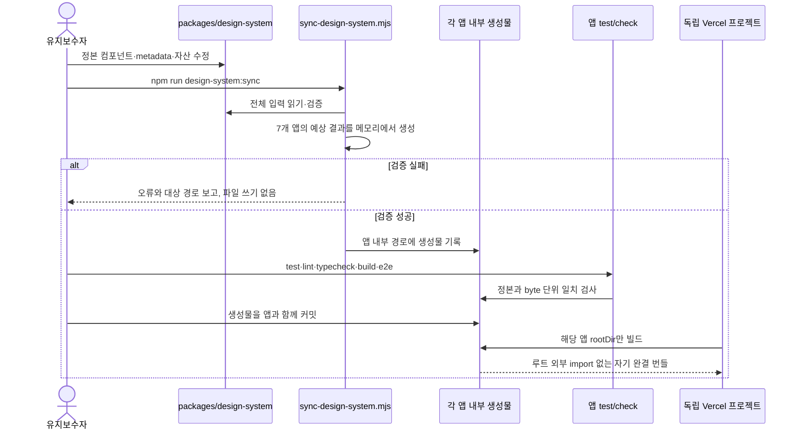

# Tool Hub 제품 셸·UI 프리미티브 통일 설계

**Date:** 2026-07-27
**Status:** 문서 승인 완료

## 목적

독립 배포되는 Tool Hub 웹 도구들이 같은 제품군으로 보이도록 제품 셸과 반복 UI의 정본을 확장한다. 현재 `packages/design-system/`은 토큰과 `.ds-card`, `.ds-icon-btn`까지만 동기화하므로 헤더, 브랜드 마크, 테마 토글, 버튼, Segmented Control, Empty State, Badge가 앱마다 다시 갈라질 수 있다.

이번 작업은 다음을 달성한다.

- `home`을 제외한 7개 웹 도구를 동일한 카드형 헤더로 통일한다.
- ThemeToggle, 브랜드 마크, Button, Segmented Control, Empty State, Badge의 정본 React 구현과 CSS를 생성물로 배포한다.
- Lucide를 정확히 `1.14.0`, 아이콘을 `16px / stroke 2`, 아이콘 버튼을 `36px`로 고정한다.
- 제품명 표기, 한국어 UI, 제품별 브랜드 아이콘과 파비콘을 단일 metadata에서 관리한다.
- 375·768·1440px 공통 셸 계약과 라이트·다크 시각 회귀를 7개 앱에서 자동 검사한다.
- 각 앱이 자기 디렉터리만으로 빌드되도록 유지해 독립 Vercel 배포에 영향을 주지 않는다.

## 선행 설계와의 관계

이 문서는 [`2026-07-25-design-system-unification-design.md`](./2026-07-25-design-system-unification-design.md)의 토큰·대비·생성물 동기화 구조를 유지하면서 제품 셸과 React 프리미티브를 확장한다.

다음 항목은 이 문서가 이전 설계를 대체한다.

- 공통 카드형 헤더 대상은 `home`을 제외한 7개 웹 도구다.
- `openapi-editor`도 데스크톱에서 다른 도구와 같은 1행 카드형 헤더를 쓴다. 별도 랜딩형·상시 2행 헤더 예외를 두지 않는다.
- `home`은 평면형 sticky 헤더를 유지하는 명시적 예외다.
- 7개 도구 모두 `lucide-react`를 도입하고 정확히 `1.14.0`으로 고정한다. 커스텀 SVG 예외를 허용하지 않는다.
- 공통 셸은 계약만 공유하지 않고 정본 React 소스를 앱 내부 생성물로 동기화한다.

## 범위

### 카드형 셸·React 프리미티브 대상

| 앱 | 스택 | 헤더 | 컴포넌트 생성물 | 공통 셸 E2E |
|---|---|---|---|---|
| `sign-maker` | Vite + React | 카드형 | 적용 | 적용 |
| `json-yaml-converter` | Vite + React | 카드형 | 적용 | 적용 |
| `openapi-editor` | Vite + React | 카드형 | 적용 | 적용 |
| `api-contract-test-generator` | Vite + React | 카드형 | 적용 | 적용 |
| `ddl-seed-generator` | Next.js | 카드형 | 적용 | 적용 |
| `config-diff-viewer` | Next.js | 카드형 | 적용 | 적용 |
| `dummy-file-generator` | Next.js | 카드형 | 적용 | 적용 |

### 예외와 비대상

- `home`: 기존 평면형 sticky 헤더와 Tool Hub 마스터 마크를 유지한다. 토큰과 파비콘 카탈로그에는 포함하지만 7개 도구용 카드 헤더·React 생성물 대상은 아니다.
- `webpage-capture-tool`: Electron 데스크톱 앱이므로 제품 셸·React 컴포넌트·웹 파비콘 대상에서 제외한다. 기존 토큰 동기화는 유지한다.
- `class-diagram-generator`: Kotlin/Spring 앱이므로 전면 제외한다.
- 각 도구의 파서, 워커, 파일 생성, 비교, 편집 등 도메인 로직과 데이터 흐름은 바꾸지 않는다.
- npm workspace나 런타임 공용 패키지를 도입하지 않는다.
- Modal/Dialog와 도메인 전용 패널을 새 공통 프리미티브로 만들지 않는다.

## 확정 아키텍처

### 정본 구조

```text
packages/design-system/
├── components/
│   ├── ToolHeader.tsx
│   ├── BrandMark.tsx
│   ├── ThemeToggle.tsx
│   ├── Button.tsx
│   ├── SegmentedControl.tsx
│   ├── EmptyState.tsx
│   └── Badge.tsx
├── favicons/
│   ├── home/
│   ├── sign-maker/
│   └── ...제품별 세트
├── fixtures/
│   └── primitives.html
├── products.mjs
├── shell-contract-e2e.ts
├── tokens.css
├── base.css
├── primitives.css
└── 기존 drift·대비 테스트
```

동기화 스크립트는 목적이 다른 대상을 분리한다.

- `TOKEN_TARGETS`: 현재처럼 `home`, 7개 도구, Electron을 포함한 9개 대상
- `WEB_TOOL_TARGETS`: 카드 헤더·React 프리미티브·셸 E2E를 받는 7개 도구
- `FAVICON_TARGETS`: `home`과 7개 웹 도구

Vite 앱에는 `src/components/design-system/`, Next.js 앱에는 `app/_components/design-system/`을 표준 생성 경로로 쓴다. 생성 컴포넌트끼리는 상대 경로만 사용하고, 외부 런타임 의존성은 `react`와 `lucide-react`뿐이다. 앱 고유 헤더는 생성된 컴포넌트를 조합하고 도메인 상태와 이벤트를 주입한다.

모든 생성 파일에는 다음 성격의 배너를 넣는다.

```text
이 파일은 packages/design-system에서 생성되었다.
직접 편집하지 말고 정본 수정 후 루트 동기화 명령을 실행한다.
```

### 제품 metadata

`products.mjs`가 제품 ID, 표시명, 한국어 설명, Lucide 아이콘, 생성 대상, 파비콘 대상, E2E 포트를 관리한다. 앱 코드가 빌드 시 루트 파일을 import하지 않도록 앱별 `product.generated.ts`를 생성한다.

| ID | 표시명 | 설명 | 아이콘 | E2E 포트 |
|---|---|---|---|---:|
| `sign-maker` | Sign Maker | 손글씨 서명을 만들고 내보냅니다. | `PenLine` | 4180 |
| `json-yaml-converter` | JSON/YAML Converter | JSON과 YAML을 변환하고 검증합니다. | `Braces` | 4173 |
| `openapi-editor` | OpenAPI Editor | OpenAPI 문서를 작성하고 미리 봅니다. | `FileCode2` | 4174 |
| `api-contract-test-generator` | API Contract Test Generator | OpenAPI 계약에서 테스트를 생성합니다. | `FlaskConical` | 4175 |
| `ddl-seed-generator` | DDL Seed Generator | DDL을 분석해 시드 데이터를 생성합니다. | `Database` | 4177 |
| `config-diff-viewer` | Config Diff Viewer | 설정 파일의 차이를 비교합니다. | `GitCompareArrows` | 4176 |
| `dummy-file-generator` | Dummy File Generator | 원하는 형식과 크기의 더미 파일을 생성합니다. | `FilePlus2` | 4178 |

`home`은 표시명과 파비콘 대상에는 들어가지만 Lucide 기능 아이콘 대신 기존 Tool Hub 마스터 마크를 쓴다. 이는 관리 누락이 아니라 의도된 브랜드 계층 예외다.

### 생성물 동기화와 독립 배포



각 Vercel 프로젝트는 배포 시 루트 동기화 명령을 실행하지 않는다. 생성물을 앱 내부에 커밋하므로 해당 앱의 `package.json`, lockfile, 소스와 `public/`만으로 빌드된다. 이는 Vercel의 프로젝트별 Root Directory 모델과 맞는다.

- [Vercel monorepo 문서](https://vercel.com/docs/monorepos)
- [Vercel monorepo FAQ](https://vercel.com/docs/monorepos/monorepo-faq)

### 동기화 실패 처리

논리 오류로 인한 부분 동기화를 막기 위해 쓰기 전에 다음을 모두 검증한다.

- 제품 ID·표시명·아이콘·대상 경로의 누락과 중복
- 지원하지 않는 Lucide 아이콘 이름
- 대상 앱과 생성 디렉터리의 존재 여부
- `lucide-react` 선언 및 lockfile 해결 버전이 정확히 `1.14.0`인지 여부
- 필수 파비콘 파일과 manifest 항목의 존재 여부
- 생성 경로가 대상 앱 디렉터리 밖으로 벗어나지 않는지 여부

검증이 하나라도 실패하면 파일을 쓰지 않고 앱·필드·경로가 포함된 오류로 종료한다. 모든 결과를 메모리에서 생성한 후 쓰며 각 파일은 임시 파일 작성 후 rename으로 교체한다. 디스크 오류처럼 검증 이후 발생하는 예외는 이미 기록된 대상과 남은 drift를 보고하고, 다음 `--check`에서 정확히 탐지한다.

`--check`는 파일을 절대 쓰지 않고 예상 바이트와 커밋된 생성물을 비교한다. 알 수 없는 CLI 옵션도 즉시 실패시켜 잘못된 검증 성공을 막는다.

## 공통 컴포넌트 계약

### ToolHeader

세 슬롯만 제공한다.

- `brand`: `BrandMark`와 제품명·설명. 도구 앱에서는 전체가 Tool Hub 링크다.
- `actions`: 앱 고유 작업. 비어 있어도 된다.
- `utilities`: 앱 고유 유틸리티 뒤에 `ThemeToggle`을 항상 마지막으로 둔다.

컴포넌트는 앱의 상태를 소유하지 않는다. `actions`, `utilities`, `homeHref`, `theme`, `onThemeToggle`을 props로 받고 배치와 접근성 구조만 책임진다.

### BrandMark

- 프레임: 정확히 `40×40px`, `--primary` 배경, `--ds-radius-md`인 12px radius
- 아이콘: 정확히 `16×16px`, `stroke-width="2"`, `currentColor`, `--on-primary`
- 계약 셀렉터: `data-ds-brand-mark`
- 텍스트 전체를 포함한 링크에는 제품명 기반 접근성 이름을 준다.

### ThemeToggle

- 버튼: 정확히 `36×36px`, 공통 icon Button 스타일
- 아이콘: `Sun` 또는 `Moon`, `16×16px`, stroke 2
- props: 현재 `theme`, `onToggle`, 선택적 `className`
- 접근성 라벨: 현재 상태가 아니라 실행 결과를 표현한 `다크 테마로 전환` / `라이트 테마로 전환`
- 계약 셀렉터: `data-ds-theme-toggle`

### Button

- 높이: 모든 변형 `36px`
- 변형: `primary`, `secondary`, `ghost`, `danger`, `icon`
- 기본값: `type="button"`으로 폼의 암묵적 submit을 막는다.
- `icon` 변형은 `36×36px`이며 접근성 이름이 없으면 개발 환경과 테스트에서 실패한다.
- disabled는 `opacity: 1`, `--disabled`와 역할별 표면·테두리로 구분한다.
- 계약 셀렉터: `data-ds-button`, 공통 `data-ds-control`

### SegmentedControl

- 외곽 높이: `36px`, 내부 padding 2px, 각 세그먼트 높이 32px
- 단일 선택만 지원하며 `value`, `options`, `onValueChange`, `ariaLabel`, `disabled`를 받는다.
- 단순 보기 전환은 `role="group"`과 `aria-pressed` 버튼을 쓴다. 실제 탭 패널을 제어하는 경우 앱이 tab semantics를 소유하며 이 컴포넌트를 억지로 쓰지 않는다.
- disabled는 컨테이너와 개별 옵션 모두 `opacity: 1`을 유지한다.
- 계약 셀렉터: `data-ds-segmented`, `data-ds-control`

### EmptyState

- 아이콘, 제목, 설명, 선택적 action을 props로 받는 표현 컴포넌트다.
- 정적인 빈 상태에는 불필요한 `role="status"`를 부여하지 않는다. 동적 결과 알림은 앱이 live region을 소유한다.
- 고유 빈 상태 문구와 동작은 앱에 남기고 레이아웃·색·간격만 정본화한다.
- 계약 셀렉터: `data-ds-empty-state`

### Badge

- 변형: `neutral`, `primary`, `success`, `warning`, `danger`
- 텍스트와 표면 토큰 조합은 기존 대비 테스트를 통과해야 한다.
- 상태를 색만으로 전달하지 않고 텍스트를 필수로 한다.
- 계약 셀렉터: `data-ds-badge`

## 카드형 헤더와 반응형 계약

7개 도구 헤더의 공통 시각 규격은 다음과 같다.

- `--surface` 카드, `--line` 경계, 16px radius, 공통 shadow
- 데스크톱 최대폭은 앱의 기존 `--ds-container-*` 선택을 유지하되 헤더와 본문 좌우 정렬을 맞춘다.
- 768px 이상: 브랜드 / 앱 액션 / 유틸리티의 1행 grid
- 768px 미만: 첫째 줄에 브랜드와 ThemeToggle, 둘째 줄에 앱 액션을 전체 폭으로 배치
- ThemeToggle은 모든 폭에서 유틸리티의 마지막 항목
- `openapi-editor`의 작업 수가 많으면 둘째 줄이 아니라 actions 영역 내부에서 compact control 또는 overflow menu로 정리한다.

허용 브레이크포인트는 `768 / 1024 / 1280px`뿐이다. `max-width: 767px`, `1023px`, `1279px`은 같은 경계를 닫힌 구간으로 표현한 것이므로 허용한다. 375px은 CSS 분기점이 아니라 회귀 검증 뷰포트다. 기존 375, 600, 760, 901, 1180, 1190, 1199px 분기는 가장 가까운 표준 경계와 레이아웃 의도에 맞춰 제거한다.

## 제품명과 UI 언어

### 제품명

제품명은 `products.mjs`의 English Title Case만 사용한다. package name, URL slug, 로컬 저장소 키처럼 기계 식별자가 필요한 곳만 kebab-case를 유지한다.

- `openapi-editor`라는 화면 표기를 쓰지 않고 `OpenAPI Editor`를 쓴다.
- `JSON/YAML Converter`, `API Contract Test Generator`, `DDL Seed Generator`처럼 약어 casing을 보존한다.
- 문서 제목, `<title>`, metadata, 헤더, manifest 이름이 같은 정본 값을 사용한다.

### UI 언어

- 제목, 설명, 버튼, 도움말, Empty State, 오류 메시지, 접근성 라벨은 한국어다.
- JSON, YAML, OpenAPI, DDL, SQL, API 같은 기술 식별자는 원문을 유지한다.
- 단위는 `B`, `KiB`, `MiB`처럼 표준 기호를 사용한다.
- 코드, 샘플 데이터, 파일 형식명, HTTP method는 번역하지 않는다.

대표 치환은 다음과 같다.

| 기존 | 정본 표현 |
|---|---|
| Draw | 그리기 |
| Upload | 업로드 |
| Sample | 샘플 |
| Generate | 생성 |
| realistic | 사실적 |
| File Format | 파일 형식 |
| Target Size | 목표 크기 |
| Generate File | 파일 생성 |
| STEP | 단계 |
| bytes | B 또는 문맥상 바이트 |

문구 변경은 UI 문자열에만 적용하고 parser enum, 테스트 fixture, API 필드명은 변경하지 않는다.

## Lucide와 파비콘

### Lucide

7개 앱 모두 `package.json`과 lockfile에서 `lucide-react`를 정확히 `1.14.0`으로 고정한다. `^`와 `~` 범위를 사용하지 않는다. 아이콘은 이름 있는 Lucide export만 import하고 임의 인라인 SVG를 새로 만들지 않는다.

공통 UI 안의 모든 아이콘은 `16px / stroke 2 / currentColor`를 강제한다. 브랜드 마크도 같은 glyph 크기를 쓴다. 도메인 시각화나 캔버스 콘텐츠처럼 UI 아이콘이 아닌 그림은 이 규칙의 대상이 아니다.

### 파비콘 세트

7개 도구는 40px 파란 브랜드 프레임과 제품별 Lucide glyph를 동일하게 사용한다. `home`은 기존 Tool Hub 마스터 마크를 같은 카탈로그에서 관리한다.

각 웹 앱에 다음 파일을 생성·커밋한다.

- `favicon.svg`
- `favicon.ico`
- `favicon-16x16.png`
- `favicon-32x32.png`
- `apple-touch-icon.png` (`180×180`)
- `site.webmanifest`

정본 SVG와 raster 산출물은 `packages/design-system/favicons/<product-id>/`에 보관하고 동기화 스크립트는 바이트 그대로 `public/`에 복사한다. HTML 또는 Next metadata가 위 파일명을 명시하도록 통일한다. 파비콘 생성은 유지보수 시 루트에서만 수행하며 앱의 Vercel build에는 포함하지 않는다.

## 자동 검증

### 정본·생성물 단위 테스트

- 정본 파일과 모든 생성물의 byte 단위 drift 검사
- 7개 앱의 `package.json`과 lockfile에서 Lucide `1.14.0` 정확 일치 검사
- 제품 ID, 표시명, 아이콘, 포트, 대상 경로의 유일성 검사
- 생성 파일의 직접 수정 금지 배너 검사
- 파비콘 세트 완전성과 manifest 이름 검사
- 컴포넌트 렌더·접근성 계약 검사
- 기존 색상 대비 테스트 유지

### 공통 셸 계약 E2E

정본 `shell-contract-e2e.ts`를 7개 앱의 `e2e/ds-shell-contract-e2e.ts`로 생성한다. 각 앱의 `shell-contract.spec.ts`는 동일한 헬퍼에 제품 metadata와 앱 고유 마스크만 전달한다.

검증 뷰포트는 다음으로 고정한다.

| 이름 | 크기 |
|---|---|
| mobile | `375×812` |
| tablet-boundary | `768×900` |
| desktop | `1440×900` |

각 뷰포트와 라이트·다크 테마에서 다음을 검사한다.

- `document.documentElement.scrollWidth <= document.documentElement.clientWidth`
- body의 가로 overflow가 없는지 확인
- `[data-ds-brand-mark]`가 정확히 `40×40px`
- `[data-ds-theme-toggle]`가 정확히 `36×36px`
- `[data-ds-button]`과 `[data-ds-segmented]` 높이가 정확히 `36px`
- 모든 공통 disabled control의 계산된 `opacity === 1`
- 공통 UI SVG가 `16×16px`, `stroke-width="2"`
- ThemeToggle이 utilities 영역의 마지막 요소
- 헤더 표시명이 `products.mjs`의 casing과 일치
- 카드 배경·경계·16px radius가 계산값과 일치
- 375px에서는 actions가 둘째 줄, 768·1440px에서는 한 줄

`scrollWidth`는 일시적 애니메이션이나 off-canvas 장식의 영향을 받지 않도록 reduced-motion 상태와 안정화 후 측정한다.

### 시각 회귀

각 앱에서 세 뷰포트와 라이트·다크 조합마다 두 장을 커밋한다.

- 헤더 crop
- 첫 화면 셸 전체

따라서 앱당 12장, 7개 앱에서 총 84개의 기준 이미지가 생긴다. 애니메이션을 끄고 Monaco cursor, 시간, 랜덤 생성값, 파일명처럼 실행마다 달라지는 영역만 명시적으로 마스킹한다. 고정 UI까지 넓게 마스킹하지 않는다.

`packages/design-system/fixtures/primitives.html`은 Button 5종, Segmented Control, Empty State, Badge 5종의 기본·hover 대체 상태·disabled·라이트·다크를 한 화면에 렌더한다. 이 정적 fixture의 라이트·다크 기준 이미지로 컴포넌트 자체의 시각 변화를 앱 레이아웃과 분리해 확인한다.

## 마이그레이션 순서

### 1. 정본과 동기화 기반

- `products.mjs`, 7개 React 컴포넌트, 셸 E2E 헬퍼, fixture, 파비콘 정본 추가
- 기존 token sync를 전체 design-system sync로 확장
- validation-first, `--check`, 생성 배너, drift 테스트 추가

### 2. 공통 의존성과 프리미티브

- 7개 앱의 Lucide를 정확히 `1.14.0`으로 통일하고 lockfile 갱신
- Button, Segmented Control, Empty State, Badge의 앱별 중복 구현을 생성 컴포넌트로 교체
- 앱 도메인 상태·이벤트·문구 데이터는 기존 앱에 유지

### 3. 카드형 헤더

- 7개 앱을 같은 ToolHeader·BrandMark·ThemeToggle 조합으로 전환
- 제품명과 한국어 설명을 metadata 생성물로 전환
- `openapi-editor`의 랜딩형/2행 인상을 제거하고 동일한 데스크톱 1행 계약 적용
- `sign-maker`, `config-diff-viewer`, `ddl-seed-generator`의 모바일 overflow를 우선 회귀 대상으로 수정

### 4. 반응형·언어·파비콘

- 임의 breakpoint를 768/1024/1280 계약으로 정리
- UI 문자열을 한국어 정책에 맞추되 기술 식별자는 보존
- 8개 웹 앱의 제품별 파비콘 세트를 동기화하고 API Contract의 누락을 해소

### 5. 검증과 문서

- 7개 앱에 공통 셸 계약 E2E와 84개 시각 기준선 추가
- 정적 fixture 기준선 추가
- 모든 영향 앱에서 test, lint, typecheck, build, e2e 실행
- 루트 `AGENTS.md`, `docs/frontend-conventions.md`, 디자인 시스템 README와 기여 문서 갱신

## 문서 갱신 규칙

- 루트 `AGENTS.md`의 프로젝트 목록을 실제 디렉터리와 맞춘다. 상세 규칙을 길게 넣지 않고 문서 링크만 유지한다.
- `docs/frontend-conventions.md`의 “7개 앱 공통” 표현은 의미를 분리한다.
  - 테마 적용: `home` 포함 8개 웹 앱
  - 카드형 도구 셸: `home` 제외 7개 웹 도구
- 기존 “컴포넌트를 공유하지 않고 계약만 공유” 문구를 “정본 구현을 앱 내부 생성물로 동기화”로 바꾼다.
- `packages/design-system/README.md`에 생성 컴포넌트 경로, 수정 금지, 동기화·검사 명령, 파비콘 관리, 독립 배포 규칙을 기록한다.
- 제품명·UI 언어 정책을 `docs/frontend-conventions.md`에 정식 규칙으로 남긴다.

## 검증 완료 조건

다음 조건을 모두 만족해야 구현 완료로 본다.

1. 루트 design-system sync test와 `--check`가 통과한다.
2. 7개 앱에서 `lucide-react`가 정확히 `1.14.0`으로 선언·해결된다.
3. 7개 앱의 test, lint, typecheck, build가 통과한다.
4. 7개 앱의 375·768·1440 공통 셸 E2E가 라이트·다크에서 통과한다.
5. `scrollWidth`, 브랜드 40px, 테마 버튼 36px, disabled opacity 1 계약이 자동 검사된다.
6. 84개 앱 시각 기준선과 정적 fixture 기준선이 생성되고 재실행 시 안정적으로 일치한다.
7. 생성물은 앱 내부에 커밋되고 앱 코드에 `../packages/design-system` 런타임 import가 없다.
8. 루트 및 관련 문서의 앱 수·예외·제품명·언어 정책이 구현과 일치한다.

## 주요 트레이드오프와 주의사항

- 생성물을 커밋하므로 같은 코드가 7개 앱에 중복되지만, 각 Vercel 프로젝트는 자기 디렉터리만으로 안정적으로 빌드된다. 현재의 독립 배포 구조에서는 런타임 패키지 공유보다 이 선택을 권장한다.
- 84개 기준 이미지는 저장소 크기와 리뷰 비용을 늘린다. 대신 CSS 계약만으로 잡지 못하는 헤더 간격, 줄바꿈, 색상, 실제 overflow 회귀를 탐지한다.
- `lucide-react` 0.575.0·1.11.0에서 1.14.0으로 올라가는 앱은 아이콘 export와 번들 결과를 모두 확인해야 한다. exact version 고정으로 이후 비의도적 drift는 막는다.
- `openapi-editor`의 액션이 1행에 들어오면서 공간이 부족할 수 있다. 임의 breakpoint나 헤더 2행 예외를 되살리지 않고 compact control 또는 overflow menu로 해결한다.
- UI 번역은 표시 문자열에만 한정한다. 파일 형식, schema key, API method, 저장된 사용자 데이터까지 번역하면 호환성이 깨진다.
- 생성 스크립트는 검증 단계 오류에 대해 파일 쓰기 전 실패하지만, 디스크 장애까지 저장소 전체 트랜잭션으로 만들 수는 없다. 파일 단위 원자적 교체와 `--check`로 복구 가능한 상태를 보장한다.

## 최종 권장안

정본 React 구현과 자산을 각 앱 내부로 생성·커밋하는 방식을 채택한다. 이는 UI drift를 자동으로 막으면서도 7개 앱의 독립 package/lockfile/Vercel 배포 경계를 보존한다. `home`의 평면형 헤더는 제품군의 허브 계층을 드러내는 의도된 예외로 남기고, 도구 앱 7개만 동일한 카드형 헤더 계약으로 묶는다.
