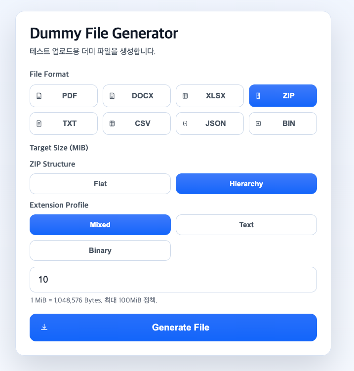

# Dummy File Generator

Next.js(App Router) 기반 더미 파일 생성기입니다. `PDF / DOCX / XLSX`를 포함해 다양한 포맷을 목표 용량으로 생성하고 다운로드합니다.

[웹페이지링크](https://dummy-file-generator.vercel.app/)




## 주요 기능
- 지원 포맷: `pdf`, `docx`, `xlsx`, `zip`, `txt`, `csv`, `json`, `bin`
- 용량 모드
  - `exact`: 목표 바이트 정확히 맞추기 시도
  - `at_least`: 목표 바이트 이상 생성
- seed 기반 재현성
- API
  - `POST /api/generate`
  - `GET /api/download/:id`
  - `POST /api/blob/sign` (현재 스텁)

## 정책
- 최소 크기: `256B`
- 최대 크기: `100MiB`
- Blob 권장 임계치: `50MiB` 초과
- 요청 빈도 제한: IP 기준 분당 20회

## 시작하기
```bash
npm install
npm run dev
```

## 요청 예시
```bash
curl -X POST http://localhost:3000/api/generate \
  -H 'content-type: application/json' \
  -d '{
    "type": "pdf",
    "targetSize": 10,
    "sizeUnit": "MiB",
    "mode": "exact",
    "seed": "fixed-seed"
  }'
```

응답의 `downloadUrl`로 파일을 다운로드합니다.

## Blob 서명 API
```bash
curl -X POST http://localhost:3000/api/blob/sign \
  -H 'content-type: application/json' \
  -d '{
    "fileName": "dummy_pdf_10485760_20260222164000.pdf",
    "contentType": "application/pdf",
    "sizeBytes": 10485760
  }'
```

현재는 스텁 응답이며, 실제 Vercel Blob 연동 시 `BLOB_READ_WRITE_TOKEN`과 `@vercel/blob`를 연결해야 합니다.

## 테스트/문서
- 테스트 플랜: `/Users/dongjin/dev/study/tool-hub/dummy-file-generator/tests/TEST_PLAN.md`
- API 문서: `/Users/dongjin/dev/study/tool-hub/dummy-file-generator/docs/API.md`

## 제한 사항
- 생성 파일은 메모리 저장소(Map)에 30분 TTL로 보관됩니다.
- 서버 재시작 시 메모리 저장소 데이터는 유실됩니다.
