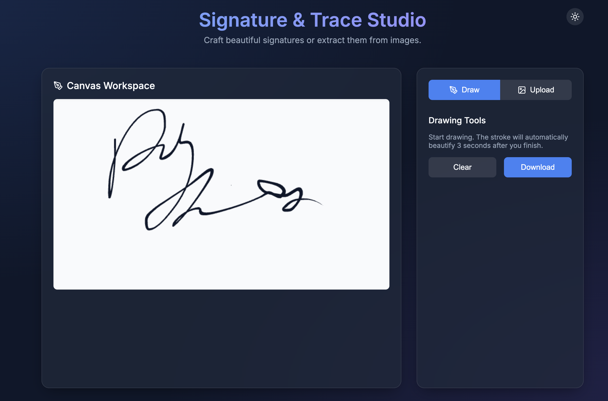
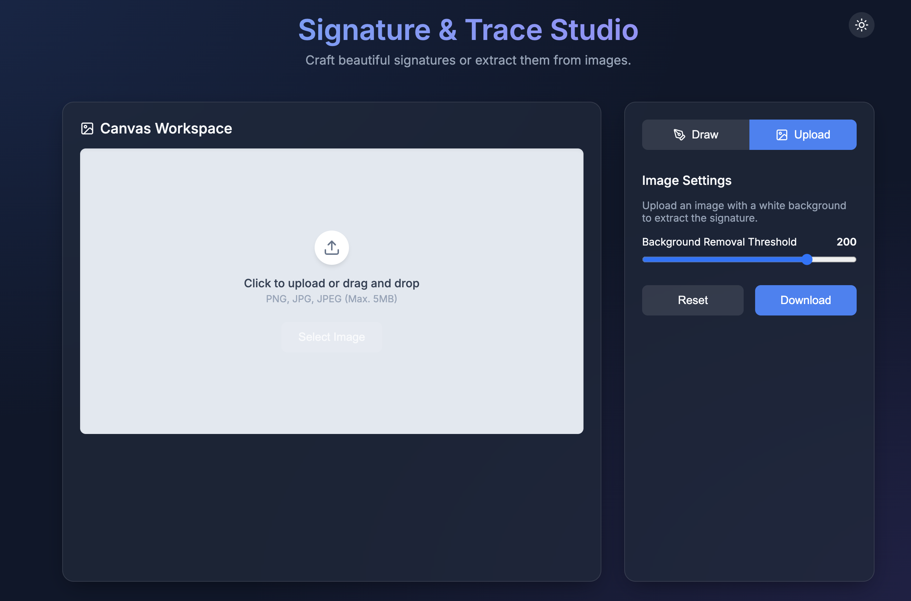

# Signature & Trace Studio

> 매력적인 서명을 직접 그리거나 사진에서 추출할 수 있는 스마트 웹 애플리케이션입니다.

[웹페이지링크](https://tool-hubsign-maker.vercel.app/)

## 주요 기능 (Features)

### 1. 스마트 서명 보정 캔버스 (Intelligent Signature Pad)
*   **자유로운 드로잉**: 마우스나 터치 환경에서 제한 없이 자유롭게 선을 그릴 수 있습니다.
*   **3초 자동 보정 (Auto-beautify)**: 사용자가 입력을 멈추고 3초가 지나면 투박한 선을 부드럽고 매끄러운 곡선으로 자동 보정합니다. (실시간 카운트다운 UI 지원)
*   **리얼 펜 이펙트**: 입력 속도에 비례한 선의 굵기 조절 및 끝부분 붓펜 효과(테이퍼링/안정화)를 `perfect-freehand` 라이브러리로 렌더링합니다.

### 2. 스마트 이미지 투명화 (Image Background Removal)
*   **드래그 앤 드롭 업로더**: 종이에 쓴 자필 서명 사진을 클릭하거나 쉽게 드래그 앤 드롭하여 캔버스에 업로드할 수 있습니다.
*   **실시간 투명도 임계값 조절 (Threshold Control)**: 업로드 후 조절 슬라이더를 통해 배경색(흰색 영역)을 정밀하게 날려버리고 서명 영역만 선별할 수 있습니다.

### 3. 공통 테마 및 내보내기
*   **다크 ↔ 라이트 테마 토글**: 일관성 있는 글래스모피즘(Glassmorphism) 기반 디자인 안에서 취향에 맞게 라이트 모드와 다크 모드를 원버튼으로 전환합니다.
*   **투명 PNG 다운로드**: 제작한 캔버스 결과물을 배경이 투명한 고화질 `.png` 파일로 단 한 번의 클릭을 통해 PC에 파일로 내려받을 수 있습니다.

## 기술 스택 (Tech Stack)

*   **Framework**: React 18, Vite
*   **Language**: TypeScript
*   **Styling**: Vanilla CSS (CSS Variables 기반 라이트/다크 테마 스위칭, Glassmorphism UI)
*   **Key Libraries**:
    *   [`perfect-freehand`](https://github.com/steveruizok/perfect-freehand): 스트로크 알고리즘 연산 및 스플라인 렌더링
    *   [`lucide-react`](https://lucide.dev/): 벡터 아이콘 (Sun, Moon, Pen, Image 등)
