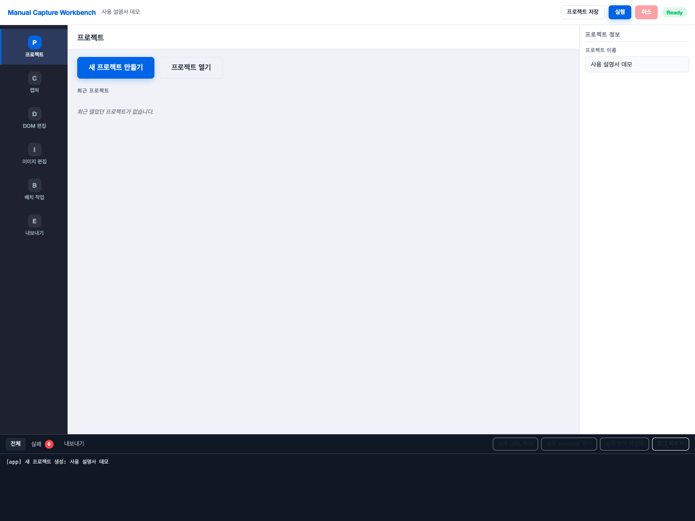
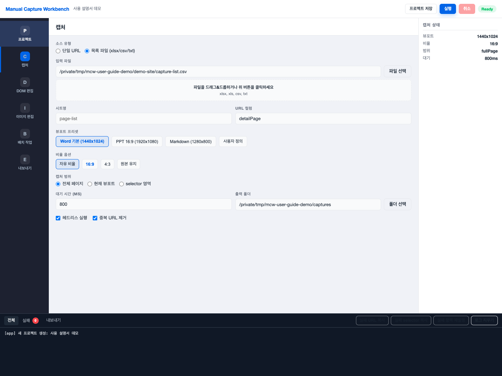
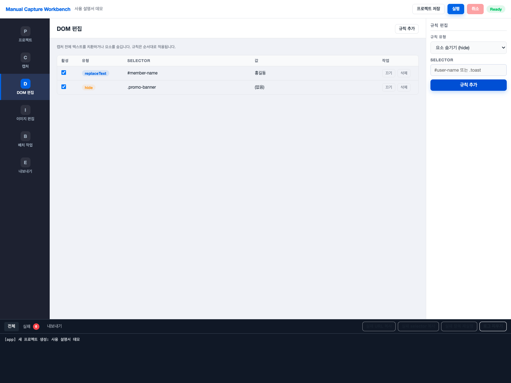
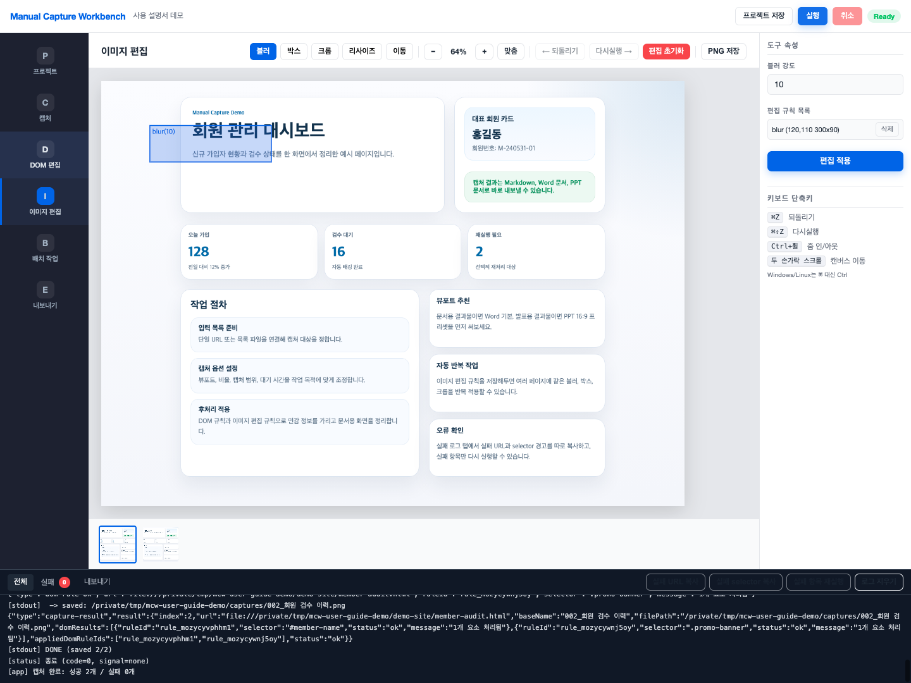
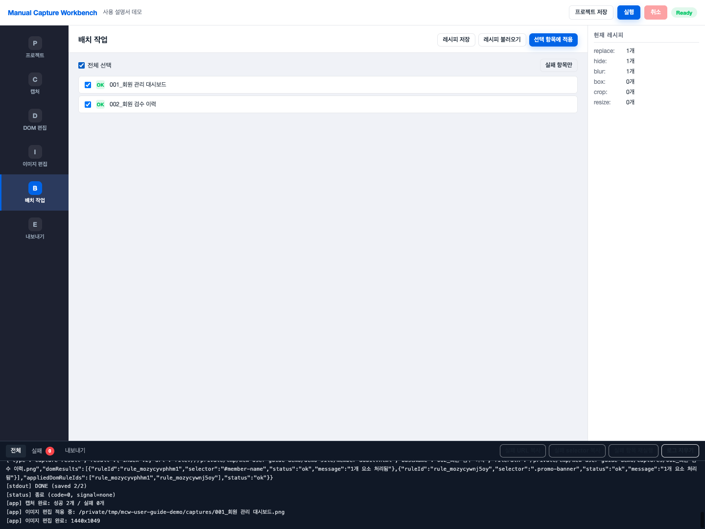
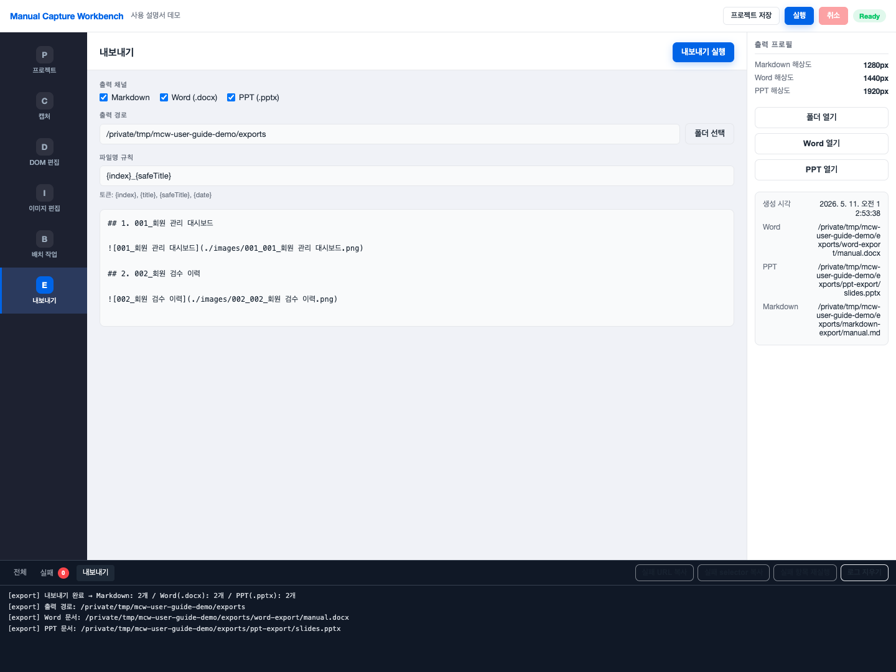

# Manual Capture Workbench 사용 설명서

`Manual Capture Workbench`는 웹페이지를 문서용 이미지로 캡처하고, DOM 치환과 이미지 편집을 거쳐 Markdown/Word/PPT 자산으로 정리하는 Electron 앱입니다.

아래 이미지는 실제 Electron 앱을 실행한 뒤 `node docs/scripts/generate-user-guide-assets.js`로 자동 생성한 화면입니다.

## 1. 시작하기

### 1-1. 설치

저장소 루트인 `webpage-capture-tool/`에서 아래 명령을 실행합니다.

```bash
npm install
npm run setup
```

- `npm install`: 워크스페이스 전체 의존성을 설치합니다.
- `npm run setup`: Playwright Chromium을 설치합니다.

### 1-2. 앱 실행

```bash
npm start
```

### 1-3. 샘플 입력 파일

바로 테스트해보려면 아래 샘플 파일을 사용할 수 있습니다.

- `docs/sample-files/sample.txt`
- `docs/sample-files/sample.csv`
- `docs/sample-files/sample.xlsx`

## 2. 화면 구성

앱을 실행하면 좌측에는 작업 단계, 중앙에는 현재 작업 화면, 우측에는 속성 패널, 하단에는 로그 패널이 보입니다.



- 좌측 메뉴: `프로젝트`, `캡처`, `DOM 편집`, `이미지 편집`, `배치 작업`, `내보내기`
- 상단 바: `프로젝트 저장`, `실행`, `취소`, 현재 상태 표시
- 하단 로그: 전체 로그, 실패 로그, 내보내기 로그를 탭으로 확인

## 3. 기본 사용 흐름

권장 흐름은 아래 순서입니다.

1. `프로젝트`에서 새 프로젝트를 만들고 이름을 정합니다.
2. `캡처`에서 입력 소스와 뷰포트, 비율, 캡처 범위를 정합니다.
3. 필요하면 `DOM 편집`에서 텍스트 치환이나 요소 숨김 규칙을 넣습니다.
4. 상단 `실행` 버튼으로 캡처를 시작합니다.
5. `이미지 편집`에서 블러, 박스, 크롭, 리사이즈를 적용합니다.
6. 같은 편집을 여러 장에 반복하려면 `배치 작업`을 사용합니다.
7. `내보내기`에서 Markdown/Word/PPT 결과물을 생성합니다.

## 4. 프로젝트 만들기

`프로젝트` 화면에서 `새 프로젝트 만들기`를 누르면 프로젝트 이름, 기본 출력 경로, 기본 뷰포트를 정할 수 있습니다.

- 프로젝트 이름: 작업 묶음을 구분하는 이름입니다.
- 기본 출력 경로: 캡처 이미지가 저장될 기본 폴더입니다.
- 기본 뷰포트: `Word 기본`, `PPT 16:9`, `Markdown` 중 하나를 시작점으로 고릅니다.

프로젝트를 저장해두면 다음에 다시 열어 캡처 설정, DOM 규칙, 편집 규칙, 캡처 결과를 이어서 사용할 수 있습니다.

## 5. 캡처 설정

`캡처` 화면에서 입력 소스와 화면 크기, 대기 시간, 저장 위치를 설정합니다.



### 5-1. 입력 소스

- `단일 URL`: 한 페이지만 빠르게 캡처할 때 사용합니다.
- `목록 파일 (xlsx/csv/txt)`: 여러 페이지를 한 번에 캡처할 때 사용합니다.

목록 파일 사용 시:

- `txt`: 한 줄에 URL 하나씩 입력합니다. `#`로 시작하는 줄은 주석으로 처리됩니다.
- `csv` / `xlsx`: URL 컬럼명을 지정해서 읽습니다.

### 5-2. 뷰포트와 비율

- 뷰포트 프리셋: `Word 기본 (1440x1024)`, `PPT 16:9 (1920x1080)`, `Markdown (1280x800)`, `사용자 정의`
- 비율 옵션: `자유 비율`, `16:9`, `4:3`, `원본 유지`

문서 화면이면 `Word 기본`, 발표 화면이면 `PPT 16:9`부터 시작하는 것이 편합니다.

### 5-3. 캡처 범위

- `전체 페이지`: 스크롤 가능한 전체 길이를 저장합니다.
- `현재 뷰포트`: 지금 보이는 영역만 저장합니다.
- `selector 영역`: 특정 DOM 영역만 잘라서 저장합니다.

### 5-4. 추가 옵션

- `대기 시간 (ms)`: 페이지 렌더링이 느릴 때 충분히 늘려줍니다.
- `탐색 깊이`: `0`, `1`, `2` 중 하나를 지정합니다. `0`은 입력 URL만 캡처하고, `1`과 `2`는 같은 origin의 링크를 지정 단계까지 따라가며 추가 캡처합니다.
- `헤드리스 실행`: 브라우저를 백그라운드로 실행합니다.
- `중복 URL 제거`: 동일한 URL이 여러 번 들어온 경우 중복 실행을 막습니다.

## 6. DOM 편집

캡처 전에 화면 내용을 바꿔야 한다면 `DOM 편집`을 사용합니다.



캡처 화면에서 입력한 단일 URL이나 캡처 결과 URL을 기준으로 DOM 후보를 불러올 수 있습니다.

1. `DOM 편집` 화면의 `미리보기 URL`을 확인합니다.
2. `DOM 불러오기`를 누릅니다.
3. 표시된 DOM 후보를 클릭하면 우측 `Selector` 입력칸에 자동으로 채워집니다.
4. 규칙 유형과 변경 값을 정한 뒤 `규칙 추가`를 누릅니다.

지원 규칙은 두 가지입니다.

- `replaceText`: selector에 해당하는 요소의 텍스트를 다른 값으로 바꿉니다.
- `hide`: selector에 해당하는 요소를 숨깁니다.

활용 예시:

- 실제 이름을 `홍길동` 같은 공용 이름으로 치환
- 배너, 알림, 광고, 버튼 등 문서에 필요 없는 요소 숨김

DOM 규칙은 캡처 직전에만 적용되며, 원본 사이트 파일을 수정하는 방식은 아닙니다.

## 7. 캡처 실행과 로그 확인

설정이 끝났으면 상단의 `실행` 버튼을 누릅니다.

- 실행 중에는 상태 배지가 `실행 중...`으로 바뀝니다.
- 하단 `전체` 로그에서 진행 상황을 확인할 수 있습니다.
- 실패가 발생하면 `실패` 탭에 URL과 selector 경고가 따로 쌓입니다.

실패 관련 보조 기능:

- `실패 URL 복사`
- `실패 selector 복사`
- `실패 항목 재실행`

## 8. 이미지 편집

캡처가 끝나면 `이미지 편집`에서 결과 이미지를 다듬습니다.



지원 도구:

- `블러`: 민감 정보를 흐리게 처리합니다.
- `박스`: 지정 영역을 단색 박스로 가립니다.
- `크롭`: 필요한 영역만 남기고 잘라냅니다.
- `리사이즈`: 결과 이미지 폭을 줄이거나 맞춥니다.
- `이동`: 큰 이미지를 드래그해 보면서 편집 위치를 잡습니다.

추가 기능:

- 썸네일 스트립으로 여러 캡처 이미지 전환
- `되돌리기`, `다시실행`
- `맞춤`, `줌 인`, `줌 아웃`
- `PNG 저장`

편집을 실제 파일에 반영하려면 우측 패널의 `편집 적용`을 눌러야 합니다. 적용된 편집 규칙은 이후 `배치 작업`에서 재사용할 수 있습니다.

## 9. 배치 작업

같은 편집을 여러 캡처 결과에 반복 적용하려면 `배치 작업`을 사용합니다.



사용 방법:

1. `이미지 편집`에서 한 장을 먼저 편집하고 `편집 적용`을 눌러 규칙을 저장합니다.
2. `배치 작업`에서 대상 항목을 체크합니다.
3. `선택 항목에 적용`을 눌러 동일한 규칙을 반복 적용합니다.

추가 기능:

- `전체 선택`
- `실패 항목만`
- `레시피 저장`
- `레시피 불러오기`

레시피에는 DOM 규칙, 이미지 편집 규칙, 내보내기 프로필을 함께 담을 수 있어서 반복 작업에 유용합니다.

## 10. 내보내기

`내보내기` 화면에서는 캡처 결과를 문서 결과물 형식으로 정리할 수 있습니다.



지원 채널:

- `Markdown`
- `Word (.docx)`
- `PPT (.pptx)`

설정 항목:

- `출력 경로`: 결과 파일을 저장할 폴더
- `파일명 규칙`: `{index}`, `{title}`, `{safeTitle}`, `{date}` 토큰 사용 가능

실제 생성물 예시는 아래와 같습니다.

- `markdown-export/manual.md`
- `word-export/manual.docx`
- `ppt-export/slides.pptx`

Word 문서는 다음 요소를 기본 포함합니다.

- 표지 페이지
- 링크형 목차
- 공통 헤더/푸터와 페이지 번호
- 블루 계열 corporate-style 타이포/배너 레이아웃

PPT 문서는 다음 요소를 기본 포함합니다.

- 표지 슬라이드
- `문서 개요`, `캡처 화면` 섹션 슬라이드
- 블루 계열 corporate-style 템플릿
- 한 슬라이드 한 장 이미지 배치
- 캡션
- 발표 메모(`speaker note`) 반영

화면 가운데의 미리보기에는 Markdown 결과 예시가 표시됩니다. 내보내기 실행 후에는 우측 패널에서 아래 기능을 바로 사용할 수 있습니다.

- `폴더 열기`: 현재 export 루트 폴더 열기
- `Word 열기`: 생성된 `manual.docx` 바로 열기
- `PPT 열기`: 생성된 `slides.pptx` 바로 열기
- `최근 내보내기 결과`: 생성 시각과 실제 파일 경로 요약 확인

하단 `내보내기` 로그 탭에서도 생성 개수, 출력 경로, 실제 생성된 `manual.docx`와 `slides.pptx` 경로를 확인할 수 있습니다.

## 11. 추천 작업 패턴

- 첫 실행은 `단일 URL`로 옵션을 먼저 맞춘 뒤, 문제가 없으면 `목록 파일`로 확장합니다.
- 페이지 로딩이 불안정하면 `대기 시간`을 늘리고, `selector 영역`으로 범위를 좁혀보세요.
- 매번 같은 부분을 가려야 한다면 `이미지 편집` 한 번 후 `배치 작업`과 `레시피`를 함께 쓰는 편이 빠릅니다.
- 결과물을 협업 문서에 붙일 목적이면 `Markdown`과 `Word (.docx)`를 함께 뽑아두면 재사용성이 좋습니다.

## 12. 문서 이미지 다시 생성하기

이 설명서에 들어간 이미지를 다시 만들려면 아래 명령을 실행하면 됩니다.

```bash
node docs/scripts/generate-user-guide-assets.js
```

이 스크립트는:

- 로컬 임시 데모 페이지를 만들고
- Electron 앱을 자동으로 띄운 다음
- 프로젝트 생성, 캡처, DOM 규칙, 이미지 편집, 배치 작업, 내보내기 화면을 차례대로 캡처하고
- 실제 `manual.docx`, `slides.pptx`까지 생성한 뒤
- `docs/user-guide-assets/`에 이미지를 저장합니다.
